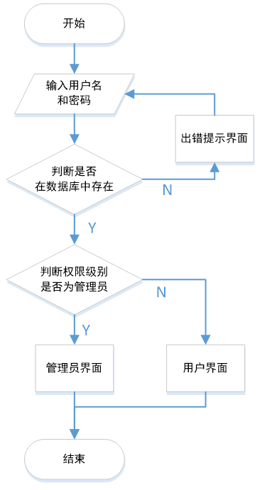
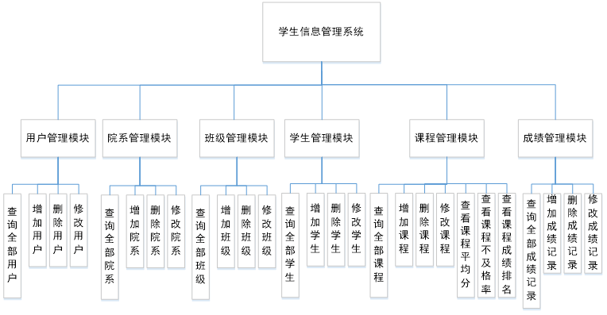
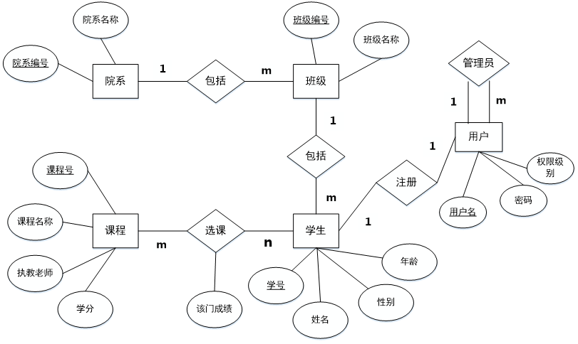

# 学生信息管理系统 (Java Web版)

> 该项目为课程设计项目

## 一、总体功能描述

本系统利用Java Web技术实现了学生信息管理系统，具有简单的学生信息管理功能。实现了以下功能模块：院系信息管理模块，学生信息管理模块，课程信息管理模块，成绩管理模块并能根据登入用户的权限自动展示相关操作。

> 功能描述

**用户登录系统实现功能：**

查看全部用户，用页面返回结果

查看全部院系，用页面返回结果

查看全部学生信息，用页面返回结果

查看全部课程信息，课程平均分，课程不及格率，用页面返回结果

查看全部成绩，用页面返回结果

**管理员登录系统实现功能**

对用户进行增删改查，用页面返回处理以及查询结果

对院系进行增删改查，用页面返回处理以及查询结果

对学生进行增删改查，用页面返回处理以及查询结果

对课程进行增删改查，并可以查看平均分、不及格率和成绩排名，用页面返回处理以及查询结果

对成绩进行增删改查，用页面返回处理以及查询结果

> 模块设计

**用户管理模块**：对用户的信息进行增删改查

**院系管理模块**：对院系的信息进行增删改查

**班级管理模块**：对班级的信息进行增删改查

**学生管理模块**：对学生的基本信息进行增删改查

**课程管理模块**：对课程进行增删改查，并能查看平均分，不及格率，成绩排名

**用户管理模块**：查询全部的用户，对用户增删改查

**权限管理**：

**全部功能**

## 二、数据库设计

**实体集：**院系、班级、用户、课程、学生。

> 逻辑结构设计：(黑体表示主键、黄色高亮表示外键)

User(**Username**,Password,Level)【这里的Username需要设置为Sno】

Department(**Dno**,Dname)

Class(**Clno**,Clname,==Dno==)

Student(**Sno**,Sname,Ssex,Sage,==Clno==)

Course(**Cno**,Cname,Cteacher,Ccredit)

SC(**==Sno,Cno==**,Grade)

> 物理结构设计

**表汇总**

| 表名       | 功能说明 |
| ---------- | -------- |
| User       | 账号     |
| Department | 院系     |
| Class      | 班级     |
| Student    | 学生     |
| Course     | 课程     |
| SC         | 成绩     |

**用户表**

| 列名     | 数据类型（精度范围） | 空/非空 | 约束条件     |
| -------- | -------------------- | ------- | ------------ |
| Username | Char(12)             | 非空    |              |
| Password | Char(12)             | 空      |              |
| Level    | Char(6)              | 空      | 用户or管理员 |

**院系表**

| 列名  | 数据类型（精度范围） | 空/非空 | 约束条件 |
| ----- | -------------------- | ------- | -------- |
| Dno   | Char(12)             | 非空    |          |
| Dname | Char(12)             | 空      |          |

**班级表**

| 列名   | 数据类型（精度范围） | 空/非空 | 约束条件 |
| ------ | -------------------- | ------- | -------- |
| Clno   | Char(12)             | 非空    |          |
| Clname | Char(12)             | 空      |          |
| Dno    | Char(12)             | 空      |          |

**学生表**

| 列名  | 数据类型（精度范围） | 空/非空 | 约束条件   |
| ----- | -------------------- | ------- | ---------- |
| Sno   | Char(12)             | 非空    |            |
| Sname | Char(8)              | 空      |            |
| Ssex  | Char(2)              | 空      | ‘男’or‘女’ |
| Sage  | Smallint(6)          | 空      | >0         |
| Clno  | Char(12)             | 空      |            |

**课程表**

| 列名     | 数据类型（精度范围） | 空/非空 | 约束条件 |
| -------- | -------------------- | ------- | -------- |
| Cno      | Char(12)             | 非空    |          |
| Cname    | Char(12)             | 空      |          |
| Cteacher | Char(8)              | 空      |          |
| Ccredit  | Smallint(6)          | 空      | >0       |

**成绩表**

| 列名  | 数据类型（精度范围） | 空/非空 | 约束条件 |
| ----- | -------------------- | ------- | -------- |
| Sno   | Char(12)             | 非空    |          |
| Cno   | Char(12)             | 非空    |          |
| Grade | Smallint(6)          | 空      | 0~100    |

## 三、算法

> 算法描述

（1） 用户在前台操作，向后台发送带参数的GET请求

（2） AdminDao.java捕捉到请求，根据类型分发到不同处理方法中

（3） 处理方法中实例化XXXDao对象并调用DBUtils.java提供的方法连接和操作数据库

（4） 用ajax向前台user.jsp或者admin.jsp发送操作后的数据

> 关键类说明

LoginServlet.java：负责处理用户登录操作

RegisterServlet.java：负责处理用户注册操作

AdminDao.java：一个Servlet文件，接收前台发送的操作指令

XXXDao.java：封装了关于该信息在数据库中增删改查的方法

DBUtils.java：封装了获取数据库连接和释放数据库连接的方法

Admin.jsp：管理员操作界面

User.jsp：用户操作界面

## 四、技术栈

- JSP + Servlet
- HTML5 + CSS3 + JavaScript + Bootstrap + Jquery

> 分层编辑思想

控制层、业务逻辑层、数据访问层

> 定义包结构

service：业务逻辑层，调用数据访问层来访问数据；

dao：数据访问层，编辑与增删改查相关的操作。

util：工具类。

## 五、系统处理流程

